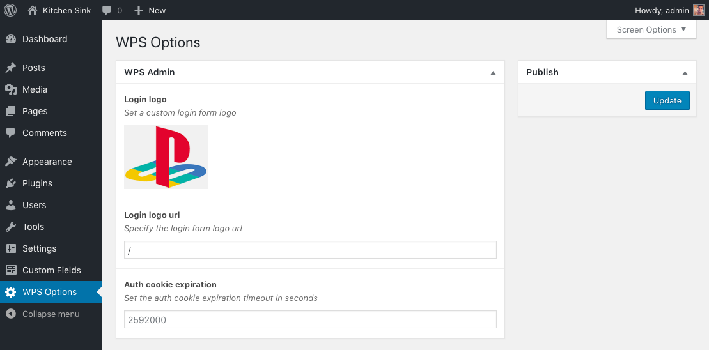

# WP-Stack

<p>
	<!-- <a href="https://travis-ci.org/Dwarvesforge/wp-stack">
		
	</a> -->
	<!-- <a href="https://www.npmjs.com/package/coffeekraken-sugar">
		
	</a>
	<a href="https://github.com/Coffeekraken/sugar/blob/master/LICENSE.txt">
		
	</a> -->
	<!-- <a href="https://github.com/coffeekraken/sugar">
		
	</a>
	<a href="https://github.com/coffeekraken/sugar">
		
	</a>
	<a href="https://github.com/coffeekraken/sugar">
		
	</a>-->
	<!-- <a href="https://twitter.com/coffeekrakenio">
		
	</a>
	<a href="http://coffeekraken.io">
		
	</a> -->
</p>

Wordpress stack that gives you nice classes as wrapper of the wordpress ones as well as some nice helper functions in these areas:

- [ACF](doc/functions/acf.md)
- [Admin](doc/functions/admin.md)
- [Archive](doc/functions/archive.md)
- [Categorie](doc/functions/categorie.md)
- [Comment](doc/functions/comment.md)
- [Image](doc/functions/image.md)
- [Is](doc/functions/is.md)
- [Media](doc/functions/media.md)
- [Menu](doc/functions/menu.md)
- [Metabox](doc/functions/metabox.md)
- [Pagination](doc/functions/pagination.md)
- [Post](doc/functions/post.md)
- [Search](doc/functions/search.md)
- [User](doc/functions/user.md)
- [Util](doc/functions/util.md)
- [Widget](doc/functions/widget.md)
- Descriptive classes
	- [`WPS\ACF_Post`](doc/src/classes/WPS/ACF_Post.md) : class that represent an ACF drived post
	- [`WPS\Category`](doc/src/classes/WPS/Category.md) : class that represent a category object
	- [`WPS\Comment`](doc/src/classes/WPS/Comment.md) : class that represent a comment object
	- [`WPS\Menu_Item`](doc/src/classes/WPS/Menu_Item.md) : class that represent a menu item returned by function like [`WPS::menu`](doc/src/functions/menu/menu.md).
	- [`WPS\Post`](doc/src/classes/WPS/Post.md) : class that represent a post object
	- [`WPS\User`](doc/src/classes/WPS/User.md) : class that represent a user object
- Usable classes
	- [`WPS\Query`](doc/src/classes/WPS/Query.md) : same as [`WP_Query`](https://codex.wordpress.org/Class_Reference/WP_Query) but return posts in [`WPS\Post`](doc/src/classes/WPS/Post.md) object format

## Table of content

1. [Goals](#readme-goals)
2. [Install](#readme-install)
3. [Documentation](doc)
4. [Options page](#readme-options-page)
5. [Contribute](#readme-contribute)
6. [License](#readme-license)
7. [Who are Dwarvesforge](#readme-who-are-dwarvesforge)

<a id="readme-goals"></a>
## Goals

The main goal is to give you access to some nice features like some cool wrapper classes and some helper functions to help you develop your wordpress more like a developer than a designer trying to code something.
We will make this package grow every time we encounter and implement some nice functions/classes/helpers.

<a id="readme-install"></a>
## Install

```
composer require dwarvesforge/wp-stack
```

<a id="readme-options-page"></a>
## Options page



WP-Stack offer the ability to have an options page in the admin that expose a UI to some of the programatic features like `google_analytics`, `excerpt_length`, `set_login_logo`, etc...

In order to access this page, you'll need two things:

1. Having a proper running [ACF Advanced Custom Fields PRO](https://www.advancedcustomfields.com/pro/) plugin installed
2. Call the `WPS::enable_options_page()` function in your `functions.php` file

<a id="readme-contribute"></a>
## Contribute

Dwarvesforge is an open source project and will ever be! You are more that welcomed to contribute to his development and make it more awesome every day.
To do so, you have several possibilities:

1. [Share the love ❤️](https://github.com/Dwarvesforge/dwarvesforge/blob/master/contribute.md#contribute-share-the-love)
2. [Declare issues](https://github.com/Dwarvesforge/dwarvesforge/blob/master/contribute.md#contribute-declare-issues)
3. [Fix issues](https://github.com/Dwarvesforge/dwarvesforge/blob/master/contribute.md#contribute-fix-issues)
4. [Add features](https://github.com/Dwarvesforge/dwarvesforge/blob/master/contribute.md#contribute-add-features)

<a id="readme-license"></a>
## License

The code is available under the [MIT license](LICENSE.txt). This mean that you can use, modify, or do whatever you want with it. This mean also that it is shipped to you for free, so don't be a hater and if you find some issues, etc... feel free to [contribute](https://github.com/Dwarvesforge/dwarvesforge/blob/master/contribute.md) instead of sharing your frustrations on social networks like an asshole...

<a id="readme-who-are-dwarvesforge"></a>
## Who are Dwarvesforge

We try to be **some cool guys** that build **some cool tools** to make our (and yours hopefully) **every day life better**.  

#### [More on who we are](https://github.com/Dwarvesforge/dwarvesforge/blob/master/who-are-we.md)
